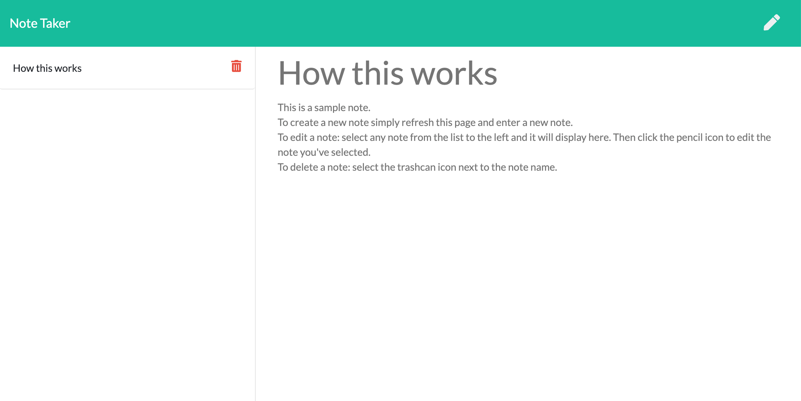

# Scribe

[](https://www.gnu.org/licenses/gpl-3.0)



## Description
A simple note taking app built with js and run on express. It allows a user to write, veiw and delte notes.

## Installation

*Requires Node.js to run*

Download and save the contents of this repo

Using your preferred console, navigate to the program's root folder (./scribe/). and run
```
npm install
```
all dependencies listed in package.json will be installed.

## Usage
After installation, run the following command in the working directory:
```
node server.js
```
then open a browser to localhost:3000

## Credits:

Thanks to support from:

- [Plover Brown](https://github.com/rebgrasshopper)
- [Nick Konzen](https://github.com/NTKonzen)
